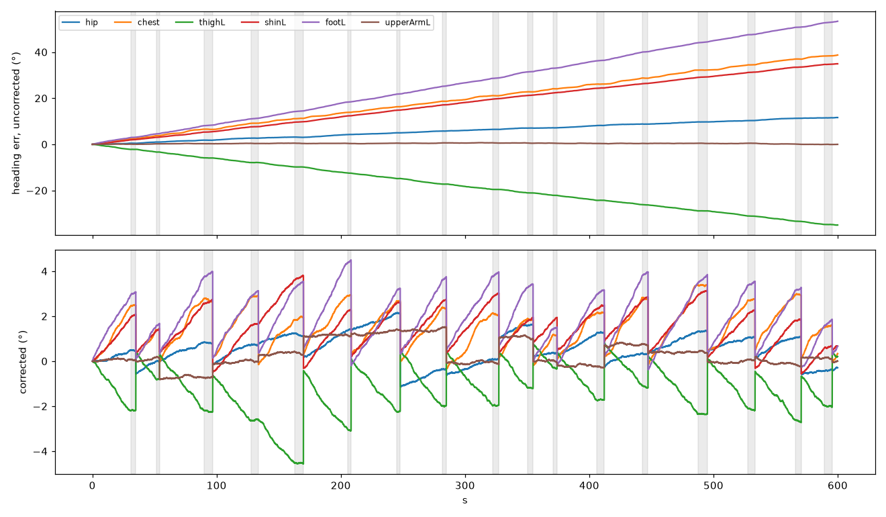
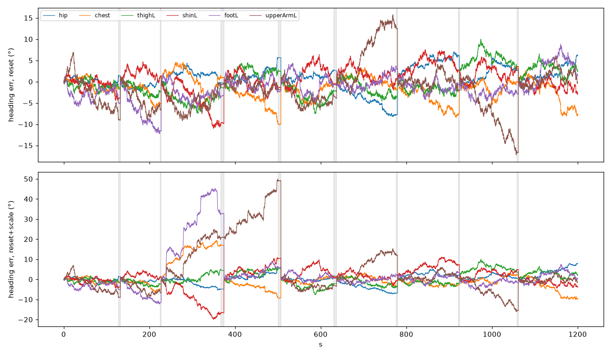
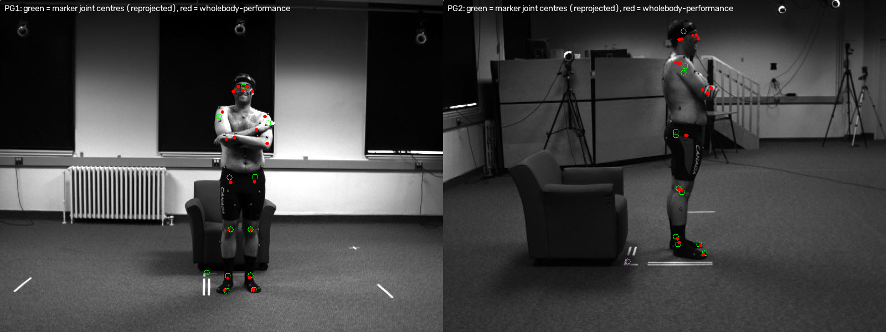
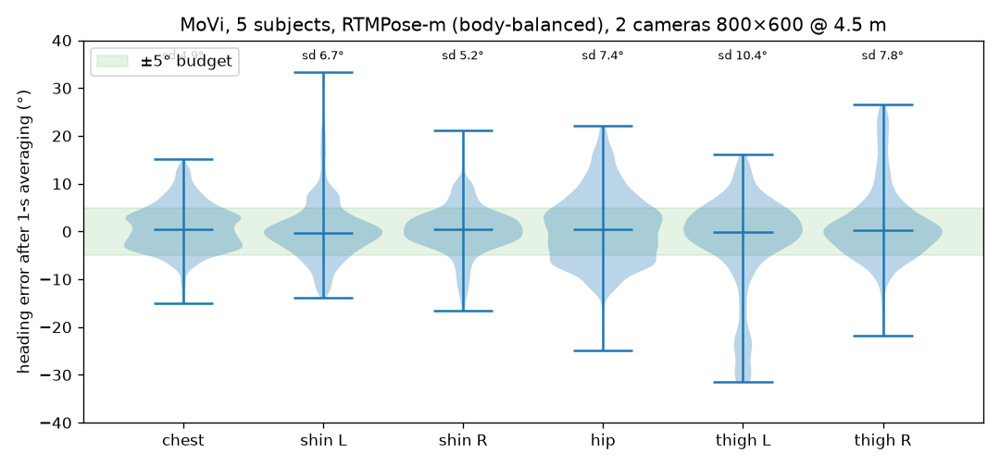
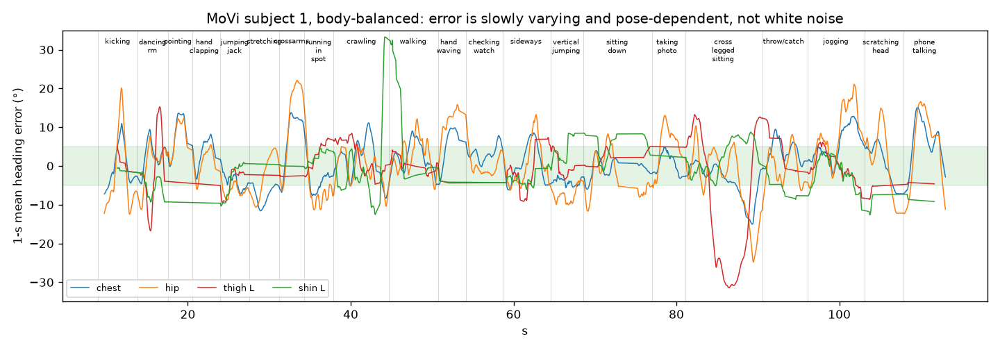
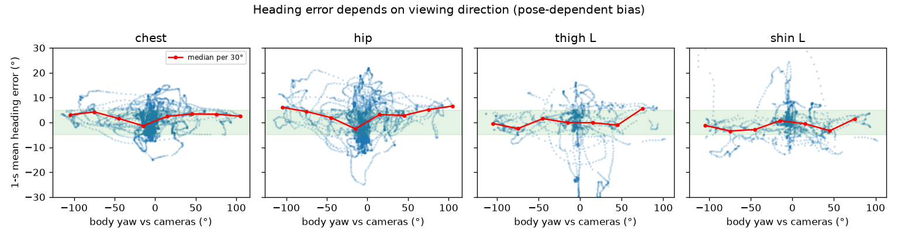
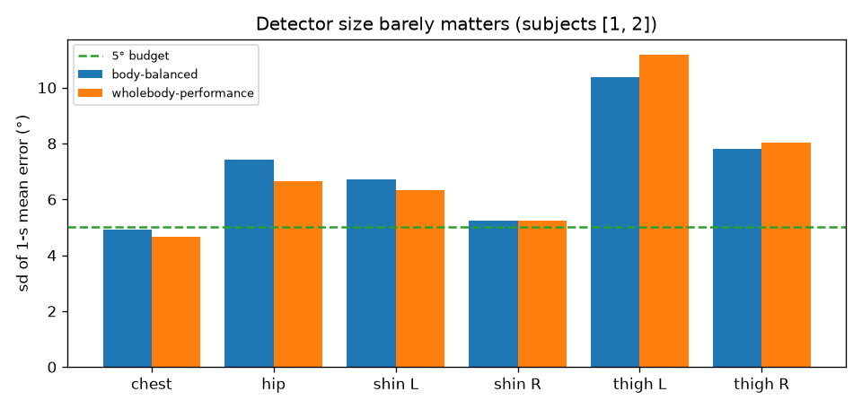
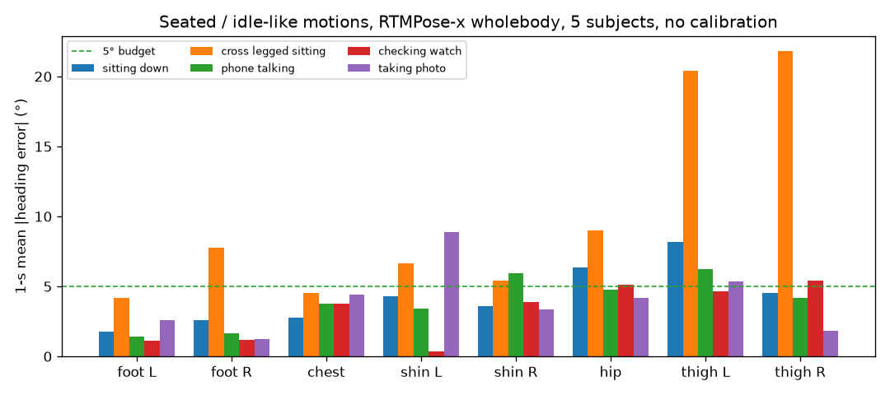

# Camera-assisted drift correction for SlimeVR — Report, sessions 1–2 (2026-08-26/27)

Figures in `docs/figures/`. Decisions D1–D30 in `STATE.md`; literature in `literature/`.

## 1. Problem and framing

SlimeVR trackers report orientation only; positions come from forward
kinematics, so a bone's yaw error is the position error of everything distal
(10° at the hip ≈ 15 cm at the feet). Pitch/roll are gravity-anchored; yaw is
pure gyro integration. drift-lab (David, 2026-08-25) established that the
drift is not a bias — static drift < 1 °/h — but **gyro scale-factor error**
(+0.43 % / −0.23 % per unit, opposite signs) plus unpredictable motion-driven
error. Per D26 the tracker is treated as a black box: the camera is the only
ground truth, and per-unit drift statistics are learned at runtime only to
schedule corrections.

**Product shape (D33, David):** an *automatic full reset in familiar poses*.
Nothing is corrected during arbitrary motion. Whenever the camera sees the
user in a pose it learned while the IMU was trusted — the standing reset
pose or, importantly, the user's **seated relaxed idle** — it performs the
equivalent of a full reset: pelvis, chest and feet headings plus bone
directions are measured, thighs/shins follow the same pose assumption the
manual reset makes. Heavy activity (a dance routine) is followed by a manual
reset, as today; the user is an active participant and may be prompted.
Success = the manual-reset horizon under everyday movement grows from
minutes to a session — and no more standing up straight to reset while
seated. The correction is a full 3-DoF per-tracker offset (D31): yaw-only
resets leave thermal tilt (0.8–5.7 °/h) and strap slip uncorrected. Target
v1: 5° on long bones. Setup: SteamVR + Quest 3 + 11 BNO085 trackers.

## 2. Literature (31 notes, 5 syntheses — `docs/04-lit-synthesis.md`)

- **No one has shipped camera-corrects-IMU-yaw.** VIP (von Marcard 2018) is
  the precedent: solving one heading per IMU accounts for most of the
  IMU+video fusion gain — validates the per-tracker yaw framing (D14).
- **SMPL regressors publish 22–25° per-joint rotation error** and twist is
  unreliable → estimate 3D joints, derive heading geometrically (D16).
- **Camera calibration from people reaches 0.5–2°;** the HMD trajectory fixes
  scale/position (D15). Not the bottleneck.
- **IMU-only literature never fixes global yaw** (TIC 2025 explicitly can't).
- **SlimeVR PR #1805** (jabberrock) is a one-shot phone-camera wizard doing
  yaw+mounting fit; reference only (D20). Integration slot: the Stay Aligned
  yaw hook in `Tracker.kt:300` (D22).
- Datasets with marker GT + static multi-view RGB: TotalCapture (requested),
  Fit3D, **MoVi (open download)**. None has VR-headset wearers → synthetic.
- Synthetic pipeline: Blender + MPI SMPL-X add-on (AMASS motion) + XRFeitoria,
  our own HMD/controller meshes; BEDLAM assets non-commercial (§H, pending).

## 3. Synthetic harness (experiments 01–02)

`src/slimevr_camera/`: skeleton/FK, cameras, DLT, heading estimators, gate,
correction. Two formulation results that carried into the real data:

1. **Vertical bones are unobservable from their own endpoints**; yaw comes
   from lateral features — hip width, shoulder width, heel→toe, knee/elbow
   flexion plane.
2. **Compare the same physical axis on both sides**: drift rotates every
   axis' floor projection equally, so the camera may observe any convenient
   axis and the IMU computes that same axis. (Removed a 12–14° systematic error.)

*Exp 01: injected drift (top) vs corrected error (bottom) at 3 px keypoint noise; grey = still windows.*

Exp 01: with white pixel noise, in-window camera heading error < 2° even at
10 px; residual is drift between windows. Exp 02 (revised after David's
objection): a motion-driven random walk σ_m dominates; residual ∝
σ_m·√(gross motion since last correction); scale-learning fits noise and was
dropped (D25).

*Exp 02: σ_m = 0.05 °/√°, still window every ~2 min; reset-only vs reset+learned k (no gain).*

## 4. Real detector on real video (experiment 04, MoVi)

MoVi: 2 hardware-synced calibrated 800×600 cameras ~4.5 m away + Qualisys
marker GT with Visual3D **segment frames** (true per-bone orientation).
Loader verified: calibration by marker reprojection; segment FK (row-vector
convention) to 1–5 mm against joint centres. Reference = the fixed local axis
of each segment that our estimator observes (fitted from joint centres) —
i.e. what a perfectly mounted IMU would report. Errors are reset-referenced
(per-subject median removed).

*Subject 1, frame 1000: green = marker joint centres, red = RTMPose-x wholebody. Detector hips sit above/outside the joint centres.*

*5 subjects, RTMPose-m: heading error after 1-s averaging, per bone.*

| bone | 1-s mean sd | 1-s p95 |
|---|---|---|
| chest | 5.1° | 10.7° |
| hip | 7.5° | 15.8° |
| shin L / R | 8.0 / 9.6° | 15 / 12° |
| thigh L / R | 12.5 / 12.9° | 31 / 25° |
| foot L / R (wholebody, still) | MAE 1.9 / 1.6° | 4.7 / 5.0° |

*Subject 1: the error is slowly varying and pose-dependent (thigh −30° in cross-legged sitting).*

*Error vs body yaw relative to the cameras: viewing-direction-dependent bias.*

*RTMPose-m vs RTMPose-x wholebody, subjects 1–2: model size does not help.*

All three detectors on 5 subjects (1-s mean sd, °): chest 5.1 / 5.1 / 5.2;
hip 7.5 / 7.0 / 7.2; shins 8–10 across the board; thighs 12.5–13.5.

*Seated / idle-like motions (5 subjects, wholebody, no calibration): chest and feet are inside budget; hips need the per-pose calibration; cross-legged hides feet and knees.*

**Findings**
1. The detector's heading error is **not white noise**: 30-frame averaging
   barely reduces it. It is pose- and view-dependent. Exp 01's "averaging
   removes noise" holds for pixel jitter only.
2. **Model size does not help** (RTMPose-m ≈ RTMPose-x): structural to
   where detectors place joints.
3. **Off-the-shelf detectors miss the 5° budget** on hips/thighs at this
   resolution/distance; chest and shins are borderline.
4. **Feet are the best heading source** (heel→toe, ~1.7° MAE when still),
   thighs the worst. Reliability order: feet ≈ chest > shins > hip > thighs
   (D30). Upper arms unmeasurable on MoVi (no stable twist in the GT frame).
5. Constant per-subject offsets are < 2° — a reset absorbs them; the
   pose-dependent part is the problem → **fine-tuning is load-bearing** (D28).

Caveats: 5 subjects, 800×600 at 4.5 m, few truly still frames in MoVi,
perfect calibration.

## 4b. Can the post-reset window calibrate the detector? (experiment 05)

David's idea, tested on the exp 04 data. A constant or yaw-binned offset
learned in the first 30–60 s does not transfer to the other 20 motions. But
within one pose family the error is nearly constant: first-half → second-half
of each motion leaves a residual sd of **1.8° chest, 2.1° hip, 1.9–2.6° shins,
1.9° thigh R** (5.3° thigh L). The bias is a repeatable function of pose and
view, so it is learnable — but only with a pose-conditioned model (D32):
learned globally (fine-tuning) and refined per session in the trusted window.
Corollary that became the product shape: correct in poses the trusted window
already saw, where the residual is ~2° today.

## 5. Infrastructure

Local machine (RX 9060 XT, datasets on `/mnt/data2`) + `vulcanus` (RTX 3090:
65 fps RTMPose-m via CUDA-12 onnxruntime from `pyproject`, 250 GB ext4 image
on `/mnt/slimevr-data`; `tools/vulcanus-setup.sh`). uv / Python 3.12. MoVi
pilot (5 subjects, 3 detector variants) cached on both.

## 6. Open threads

- TotalCapture access (requested); Fit3D as backup.
- §H synthetic pipeline synthesis (agent pending); BEDLAM licence.
- 5-subject evaluations of the larger detectors (running on vulcanus).
- Exp 03 (on-body drift, optional); RTSP camera model (Q6b); community
  turning statistics (Q16, minor).

## 7. Proposed next steps

1. **Automatic full reset in familiar poses (D33)** — the build target:
   familiar-pose detector (templates from the manual reset + seated/idle
   stances, learned while trusted); in-pose measurement of pelvis/chest/feet
   headings and bone directions (3-DoF); application through the full-reset
   path; confidence → prompt. Evaluate on MoVi still stances, then on our own
   recordings with recurring poses.
2. **Own-room dataset**: 2 RTSP cameras + 11 trackers + Quest 3; recorder +
   ESP32 coded-blink beacon (D17). This is where recurring idle poses exist.
3. **Pose-conditioned correction model (D32)**: global fine-tuning on MoVi /
   TotalCapture / synthetic-with-headset data, refined per session.
4. **Runtime scheduler**: per-unit drift statistics; bone weighting per D30.
